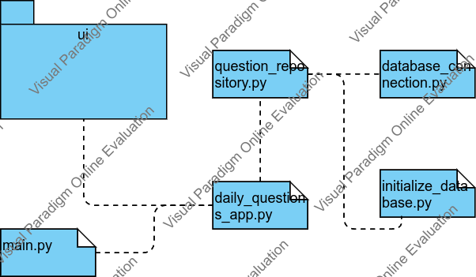
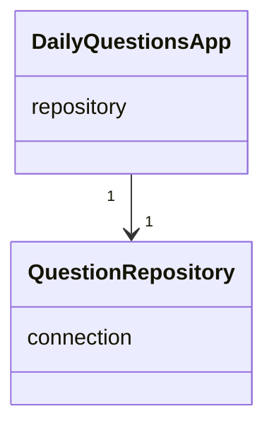
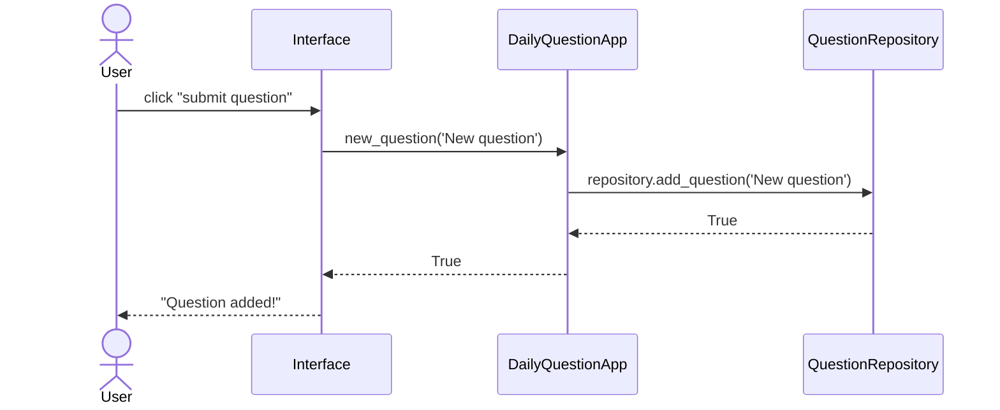
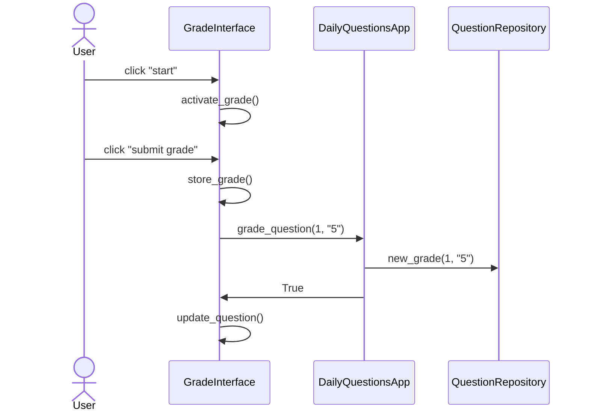

# Arkkitehtuuri

## Rakenne
Koodin pakkausrakenne on seuraava:

## Käyttöliittymä
Käyttöliittymä koostuu kolmesta eri näkymästä, jotka on koodissa toteutettu omina luokkinaan:
- aloitusnäkymä
- arviointinäkymä
- statusnäkymä

## Sovelluslogiikka

Sovelluslogiikan muodostavat pitkälti luokat [DailyQuestionsApp](https://github.com/codePercidae/ot-harjoitustyo/blob/main/src/daily_questions_app.py) ja [QuestionRepository](https://github.com/codePercidae/ot-harjoitustyo/blob/main/src/question_repository.py).

DailyQuestionsApp on hallinnoiva luokka joka toimii tiedon välittäjänä ja ohjelmalogiikkana.

## Pysyväistallennus
Luokka QuestionRepository pitää huolta tiedon tallentamiseen liittyvistä toiminnoista. Kaikki tiedot tallennetaan SQLite-tietokantaan.

Tietokanta tallenetaan .env -tiedoston määrittelemien arvojen mukaisesti.

## Päätoiminnallisuudet
Kuvataan ohjelman päätoiminnallisuuksia sekvenssikaavioiden avulla.

### Uuden kysymyksen luominen

Käyttöliittymä huomaa kun käyttäjä painaa "submit question" painiketta ja välittää uuden kysymyksen sekä siirtää kontrollin DailyQuestionsApp luokalle. Tämä puolestaan siirtää tiedot QuestionRepository luokalle joka huolehtii tiedon tallennuksesta. Mikäli kysymyksen tallennuksessa ilmenisi ongelmia, palauttaa DailuQuestionsApp arvonaan False.

### Kysymyksien arviointi

Käyttöliittymä huomaa kun käyttäjä haluaa aloittaa arvioinnin ja käynnistää active_grade metodin avulla arviointiprosessin. Käyttäjä näkee aina uuden kysymyksen johon hän antaa vastauksen ja tallettaa sen "submit grade" painikkeella. Jälleen DailyQuestionsApp luokka hoitaa tiedon välityksen ja QuestionRepository luokka tiedon tallennuksen. Kun arvosana on tallennettu onnistinueesti käyttöliittymä päivittää kysymyksen uuteen. Tätä jatkuu niin kauan kuin kysymyksiä riittää.

## Muut toiminnallisuudet
Käytännössä kaikki sovelluksen toiminnallisuus seuraa samaa logiikkaa kuin ylläolevissa esimerkeissä.
