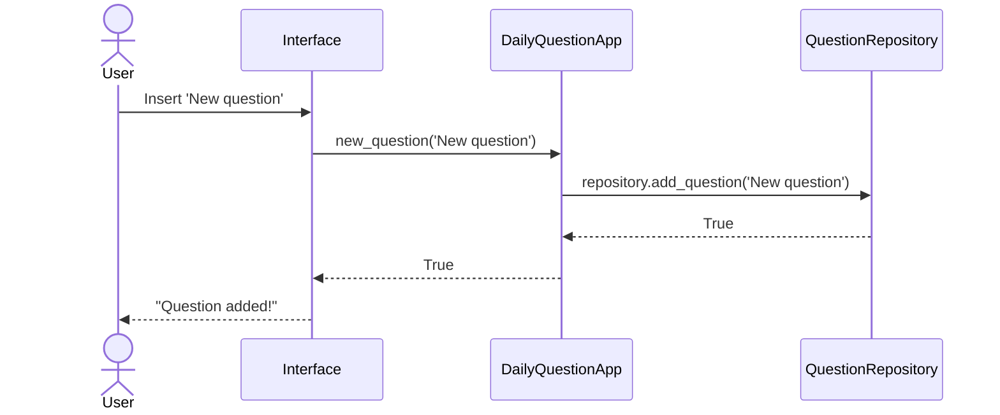

# Arkkitehtuuri

## Rakenne
Koodin rakenne on seuraava:

## Sovelluslogiikka

Sovelluslogiikan muodostaa pitkälti luokat [DailyQuestionsApp](https://github.com/codePercidae/ot-harjoitustyo/blob/main/src/daily_questions_app.py) ja [QuestionRepository](https://github.com/codePercidae/ot-harjoitustyo/blob/main/src/question_repository.py).

## Päätoiminnallisuudet
Kuvataan ohjelman päätoiminnallisuuksia sekvenssikaavioiden avulla.

### Uuden kysymyksen luominen

