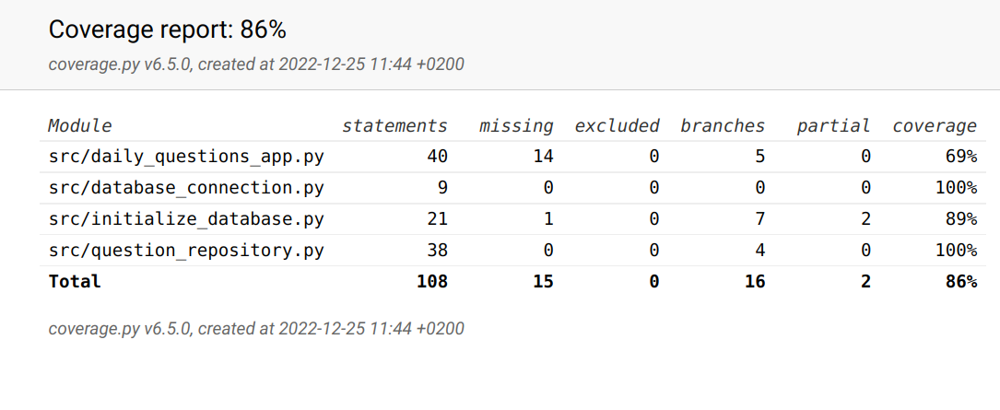

# Testausdokumentti
Sovelluksen testausta on toteutettu automatisoiduilla yksikkötesteillä ja manuaalisella järjestelmätestauksella.

## Yksikkötestit
### Sovelluslogiikka
Sovelluslogiikasta vastaavaa luokkaa DailyQuestionsApp testataan TestDailyQuestionsApp luokalla. Luokalle annetaan testitilannetta varten oma repositorio.

### Repositorio-testit
Tiedon tallennuksesta vastaavaa luokkaa QuestionRepository testataaan TestQuestionRepository luokalla. Testit toteutetaan erillisille testeille
omistetulla tietokantatiedostolle joka on määritelty .env.tests tiedostossa.

## Testikattavuus
Projektin testikattavuus on 86%. Testien ulkopuolelle jätettiin käyttöliittymän koodi, main.py ja config.py niiden huonon testattavuuden vuoksi.

## Järjestelmätestaus
Sovelluksen asennus on testattu toimivaksi Ubuntu-ympäristössä ja kaikki vaatimusdokumentin määrittelemät vaatimukset on todettu täyttyneiksi. Myös ohjelman toimintaa virheellisillä syötteillä on testattu.

