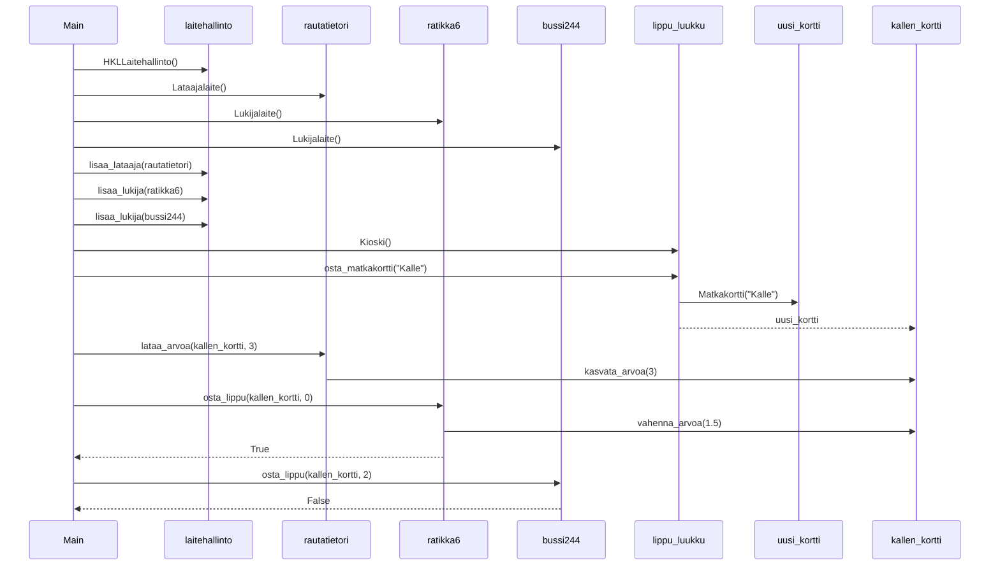

```mermaid
sequenceDiagram
    Main->>laitehallinto: HKLLaitehallinto()
    Main->>rautatietori: Lataajalaite()
    Main->>ratikka6: Lukijalaite()
    Main->>bussi244: Lukijalaite()
    Main->>laitehallinto: lisaa_lataaja(rautatietori)
    Main->>laitehallinto: lisaa_lukija(ratikka6)
    Main->>laitehallinto: lisaa_lukija(bussi244)
    Main->>lippu_luukku: Kioski()
    Main->>lippu_luukku: osta_matkakortti("Kalle")
    lippu_luukku->>uusi_kortti: Matkakortti("Kalle")
    lippu_luukku-->>kallen_kortti: uusi_kortti
    Main->>rautatietori: lataa_arvoa(kallen_kortti, 3) 
    rautatietori->>kallen_kortti: kasvata_arvoa(3)
    Main->>ratikka6: osta_lippu(kallen_kortti, 0)
    ratikka6->>kallen_kortti: vahenna_arvoa(1.5)
    ratikka6-->>Main: True
    Main->>bussi244: osta_lippu(kallen_kortti, 2)
    bussi244-->>Main: False
```
