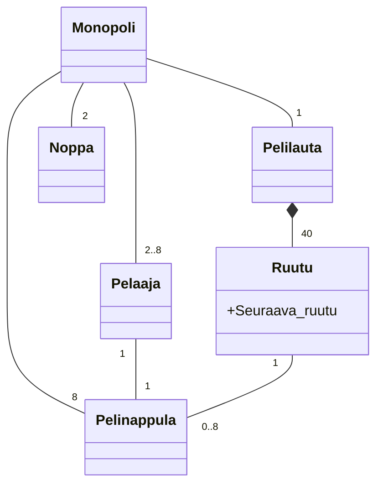

```mermaid
        classDiagram

            Monopoli -- "1" Pelilauta
            Monopoli -- "2..8"  Pelaaja
            Monopoli -- "2"  Noppa
            Monopoli -- "8" Pelinappula
            Pelaaja "1" -- "1" Pelinappula
            Pelilauta *-- "40" Ruutu
            Ruutu "1" -- "0..8" Pelinappula 
            class Pelilauta{
            }
            class Pelaaja{
            }
            class Pelinappula{
            }
            class Noppa{
            }
            class Ruutu{
                    +Seuraava_ruutu
            }
```
