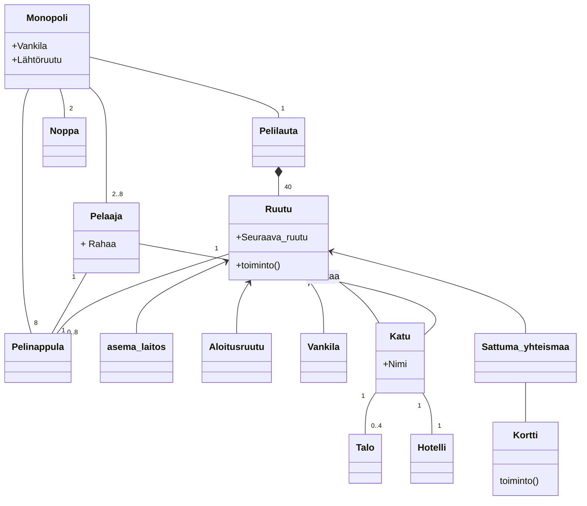

```mermaid
classDiagram

            Monopoli -- "1" Pelilauta
            Monopoli -- "2..8"  Pelaaja
            Monopoli -- "2"  Noppa
            Monopoli -- "8" Pelinappula
            Monopoli : +Vankila
            Monopoli : +Lähtöruutu
            Pelaaja "1" -- "1" Pelinappula
            Pelilauta *-- "40" Ruutu
            Ruutu "1" -- "0..8" Pelinappula
            Ruutu <-- asema_laitos
            Ruutu <-- Aloitusruutu
            Ruutu <-- Vankila
            Ruutu <-- Katu
            Ruutu <-- Sattuma_yhteismaa
            Sattuma_yhteismaa -- Kortti
            Pelaaja -- Katu :omistaa
            Katu "1" -- "0..4" Talo
            Katu "1" -- "1" Hotelli
            class Pelilauta{
            }
            class Pelaaja{
                + Rahaa
            }
            class Pelinappula{
            }
            class Noppa{
            }
            class Ruutu{
                    +Seuraava_ruutu
                    +toiminto()
            }
            class Aloitusruutu{

            }
            class Vankila{

            }
            class Sattuma_yhteismaa{

            }
            class asema_laitos{

            }
            class Katu{
                +Nimi
            }

            class Kortti{
                toiminto()
            }
            class Talo{
            }

            class Hotelli{

            }
```
